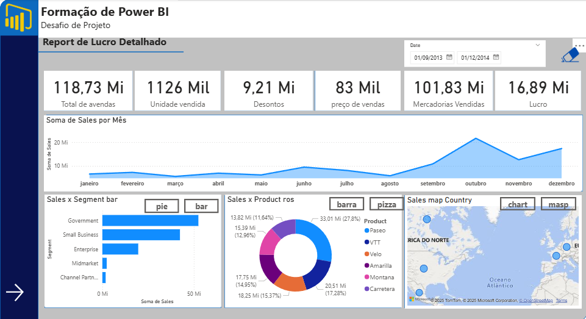
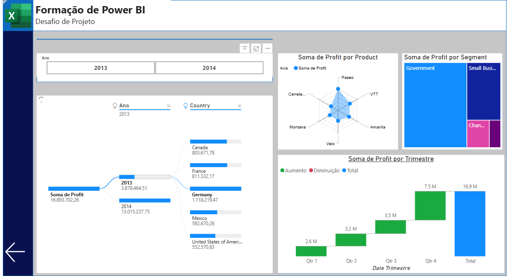

# 📊 Dashboard de Lucro Detalhado – Power BI  

Este projeto apresenta um **dashboard interativo em Power BI**, desenvolvido para análise detalhada de **vendas e lucros empresariais**.  
A solução foi construída como parte de um desafio de formação, com foco em **visualizações estratégicas** e **exploração dinâmica dos dados**.  

---
#### Link do Dashboard para visualização em tempo real

🔗 [Acesse o Dashboard Interativo no Power BI](https://app.powerbi.com/groups/me/reports/9b059736-1800-4cfd-a537-1755f3f43ca4/eb8fa38cd67154151d4c?bookmarkGuid=b62cd3c7-f09d-4437-807e-c35a68471751&bookmarkUsage=1&ctid=3fedf2f7-4b56-4eb0-b3eb-46577b2a3f9e&portalSessionId=1e000c28-56f6-4424-9fae-f1eff27b53c8&fromEntryPoint=export)  

Este projeto apresenta um **dashboard interativo em Power BI**, desenvolvido para análise detalhada de **vendas e lucros empresariais**.  

## 🎯 Objetivo do Projeto  

Fornecer uma ferramenta analítica que permita às empresas:  
- ✅ Monitorar **lucros e vendas** em diferentes períodos  
- ✅ Identificar os **produtos mais rentáveis**  
- ✅ Comparar **segmentos de mercado** e **países**  
- ✅ Avaliar a **performance trimestral** e sazonalidade  
- ✅ Apoiar a **tomada de decisões estratégicas** baseada em dados  

---

## 🧰 Tecnologias e Recursos  

- **Power BI Desktop**  
- **DAX (Data Analysis Expressions)**  
- **Excel (.xlsx)** como fonte de dados  
- Visualizações utilizadas:  
  - 📌 **Radar** → Lucro por Produto  
  - 📊 **Barras** → Lucro por Segmento e País  
  - 📈 **Linha** → Vendas Mensais  
  - 🟦 **Cartões** → Indicadores de KPIs  
  - 🧩 **Cascata** → Lucro por Trimestre  
  - 🌐 **Matriz Hierárquica** → Ano → País → Segmento → Produto  

---

## 📐 Principais Métricas  

| Métrica                     | Valor       |
|------------------------------|-------------|
| 💰 **Lucro Total**          | **16,89 M** |
| 🛒 **Total de Vendas**      | **118,73 M** |
| 📦 **Mercadorias Vendidas** | **101,83 M** |
| 🎯 **Unidades Vendidas**    | **1.126 K** |
| 💸 **Descontos**            | **9,21 M**  |
| 🏷️ **Preço Médio Vendas**   | **83 K**    |

---

## 📊 Estrutura do Dashboard  

### 🔹 Página 1 – **Visão Geral de Vendas**  
  

- Indicadores principais (**KPI Cards**)  
- Linha de **vendas mensais (2013–2014)**  
- Vendas por **segmento de mercado**  
- Vendas por **produto**  
- Vendas por **país**  

---

### 🔹 Página 2 – **Análise de Lucro Detalhada**  
  

- Radar → Lucro por Produto  
- Cascata → Lucro por Trimestre  
- Hierarquia: **Ano → País → Segmento → Produto**  
- Treemap → Lucro por Segmento  

---
